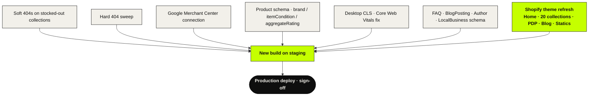
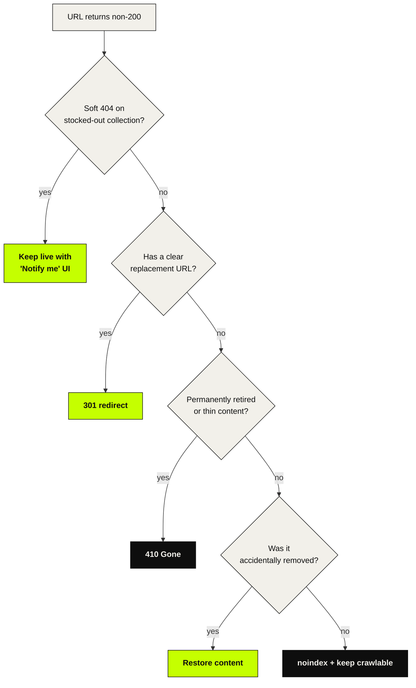

# switchkart-storefront-sprint

Working repo for the **Switchkart Shopify Theme Refresh + Search Visibility Sprint** — delivered by **Daily Web**, a [Daily Mark8ing](https://dailymark8ing.com) studio (legal entity: AKAARA SERVICES) — May 2026.

A fast theme refresh on a clean Shopify foundation, with all the April-2026 audit fixes (SEO + AEO + Core Web Vitals + Merchant Center + schema) baked into the new build. One deploy, not a theme patch followed by a separate SEO patch.

> Daily Web is the Daily Mark8ing sub-brand for websites, landing pages, and technical-web work (SEO/AEO, schema, Core Web Vitals, Shopify/Next.js theme engineering). Tagline: *Built to ship.*

---

## How the sprint moves

## The deliverable bundle

Six audit findings + a storefront refresh, shipped as **one deploy**:

## 404 decision flow

Every non-200 from the W1 crawl resolves to one of these:

---

## What's here

| File | Purpose |
|---|---|
| `PRD.md` | The product requirements document — scope, goals, deliverables, timeline, acceptance criteria, risks, commercials. **Read this first.** |
| `docs/audit-april-2026.md` | Extract of the SwitchKart SEO/AEO audit (April 2026) — the basis for sprint scope. |
| `docs/changelog.md` | Running log of every change made to the Switchkart Shopify theme + schema. Filled in during execution. |
| `docs/404-decisions.md` | Per-URL decision log for soft/hard 404 remediation. Filled in W1. |

## Project state

- **Status:** Proposed → awaiting kickoff (advance receipt triggers W1)
- **Invoice:** DW-2026-0001 — ₹50,000 + 18% GST = ₹59,000
- **Duration:** 5 weeks from kickoff (+1 week buffer)
- **Single point of contact:** Piyush Mishra · dailymark8ing.com

## Repo conventions

- This repo holds **planning + documentation** for the sprint.
- Actual theme code edits land in the Switchkart Shopify theme repo (or via Shopify Admin theme editor) — every edit gets a one-line entry in `docs/changelog.md` with file path + summary.
- Decisions made during the sprint that affect scope or timeline are appended as dated addenda at the bottom of `PRD.md` — never edited inline.

## Sharing

Published openly so Switchkart can review the proposed scope, success metrics, and timeline directly. Audit findings referenced here are summarised from the source audit PDF held with the studio; reproduction of this document for commercial pitching by third parties is not permitted.
